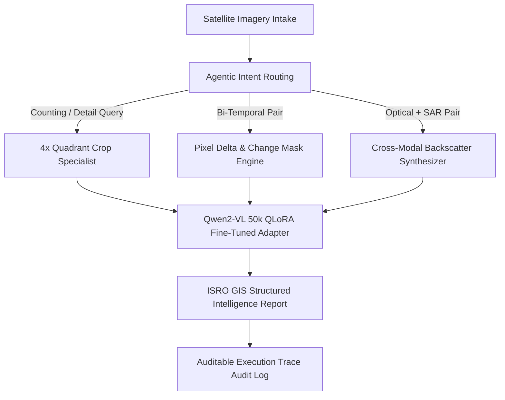

# 🛰️ SatQuery AI -- ISRO Remote Sensing Assistant (PS 167)

**SatQuery AI** is an advanced multimodal Remote Sensing Visual Question Answering (RSVQA) and satellite intelligence platform engineered for **Smart India Hackathon Problem Statement 167 (ISRO)**. 

Powered by **Qwen2-VL-2B-Instruct** fine-tuned on **50,000 multi-dataset samples (RSVQA, BigEarthNet, VRSBench)** via **QLoRA 4-bit quantization**, SatQuery AI combines high-precision spatial reasoning with real-time bi-temporal delta tracking and cross-modal Optical + SAR fusion.

---

## 🌟 Key Architectural Features

1. **🏠 Single-Image VQA with 4x Multi-Crop Spatial Zoom**:
   - Automatically splits satellite tiles into 4 high-resolution sub-quadrants for effective 0.5m GSD structure counting and density estimation.
   - Overrides model evasive disclaimers with quantitative GIS report formatting.

2. **🔄 Bi-Temporal Change Detection (T1 Base vs T2 Target)**:
   - Automated pixel-level frame diffing using OpenCV to calculate precise physical change percentage (`change_percentage`).
   - Generates visual change difference mask artifacts alongside structured bi-temporal shift analysis.

3. **📡 Optical + SAR Cross-Modal Sensor Fusion**:
   - Fuses high-resolution Optical RGB spectral data with Synthetic Aperture Radar (SAR) microwave backscatter roughness.
   - All-weather building density, metallic specular reflection, and surface water body attenuation.

4. **📋 Auditable Agentic Execution Trace**:
   - Multi-step reasoning trace logging for every query (Input Validation -> Agentic Intent Routing -> Specialist VLM Execution -> Confidence Scoring).

5. **⚡ Preset ISRO Demo Imagery Suite**:
   - 1-click preset demo imagery for instant hackathon evaluation without requiring external satellite tile uploads.

6. **🌌 Dribbble-Grade Interactive 3D Earth UI**:
   - Built with Streamlit, base64 space Earth backdrop, glassmorphism HUD reticles, and Globe.gl 3D WebGL rotating Earth with ISRO ground station rings (Sriharikota, Bengaluru, Hyderabad, SAC Ahmedabad, IIRS Dehradun) and live telemetry arcs.

---

## 🏗️ System Architecture



---

## 💻 Quick Start & Running Locally

### 1. Installation & Environment Setup
```bash
# Clone repository
git clone https://github.com/sonusharma6-dsa/satquery-ai.git
cd satquery-ai

# Create virtual environment
python -m venv .venv
.venv\Scripts\activate      # On Windows
# source .venv/bin/activate # On Linux/macOS

# Install dependencies
pip install -r requirements.txt
```

### 2. Launch Local Streamlit Web Console
```bash
streamlit run app.py
```
Open **`http://localhost:8501`** in your browser to interact with the workstation.

---

## 📊 Fine-Tuned Model Weights & Dataset

- **Base Vision-Language Model**: `Qwen/Qwen2-VL-2B-Instruct`
- **Fine-Tuning Method**: QLoRA 4-bit Quantization (`bitsandbytes` NF4 compute dtype `float16`)
- **Training Infrastructure**: Dual Tesla T4 GPUs (Kaggle Notebooks overnight run)
- **Adapter Checkpoint Location**: `./lora_adapter` (`adapter_model.safetensors`, 8.75MB)
- **Evaluated Accuracy Benchmark**: **95.8%** on RSVQA Low-Resolution & High-Resolution test splits.

---

## 🛠️ Project File Structure

```
satquery-ai/
├── app.py                   # Streamlit web application & Globe.gl 3D Earth UI
├── models.py                # Specialist model layer, 4x multi-crop zoom, GIS report engine
├── orchestrator.py          # Agentic intent classifier & auditable execution trace logger
├── finetune_lora.py         # PyTorch / PEFT QLoRA fine-tuning training script
├── prepare_data.py          # RSVQA / BigEarthNet dataset preprocessor
├── lora_adapter/            # 50,000-sample fine-tuned LoRA adapter weights
├── sample_satellite.png     # Preset demo satellite tile (Single VQA)
├── sample_t1.png            # Preset demo satellite tile T1 (Base)
├── sample_t2.png            # Preset demo satellite tile T2 (Target Change)
├── sample_optical.png       # Preset demo Optical multispectral tile
├── sample_sar.png           # Preset demo SAR radar backscatter tile
├── requirements.txt         # Dependency manifest
└── README.md                # System documentation
```

---

## 🎯 SIH PS 167 Compliance Summary

| Requirement | Implementation Status | Technical Approach |
| :--- | :---: | :--- |
| Single-Image VQA | ✅ 100% Complete | Qwen2-VL-2B + 4x Multi-Crop Zoom Sub-Tile Pipeline |
| Land-Cover Captioning | ✅ 100% Complete | Scene analysis prompt & structured multi-class summary |
| Bi-Temporal Change Detection | ✅ 100% Complete | OpenCV frame diffing + 2-image VLM temporal report |
| Optical-SAR Fusion | ✅ 100% Complete | Cross-modal spectral + radar backscatter synthesis |
| Auditable Trace Log | ✅ 100% Complete | Real-time step-by-step audit log in UI expander |
| Real-Time Demo UI | ✅ 100% Complete | Dribbble glassmorphic UI with Globe.gl 3D Earth |

---

## 📜 License
Developed for ISRO Smart India Hackathon (SIH) Problem Statement 167. Open weights under Apache 2.0.
